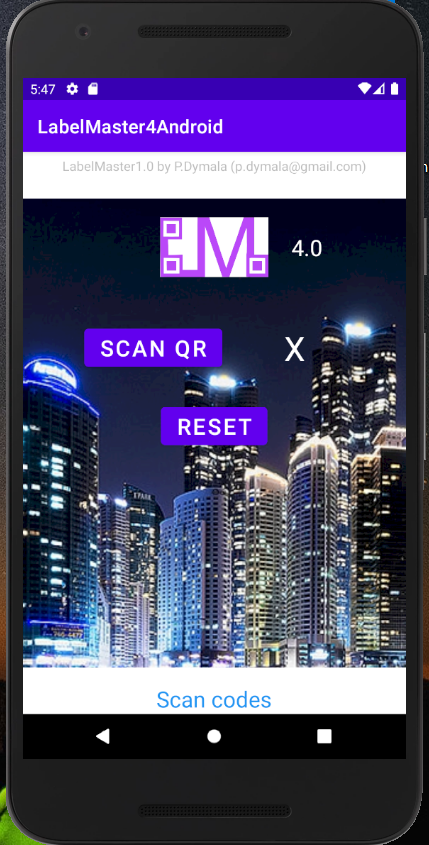
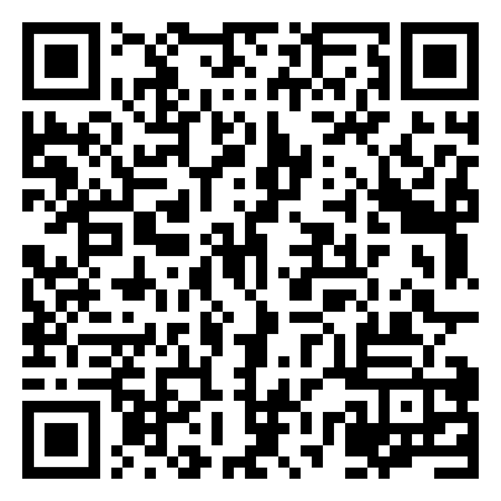
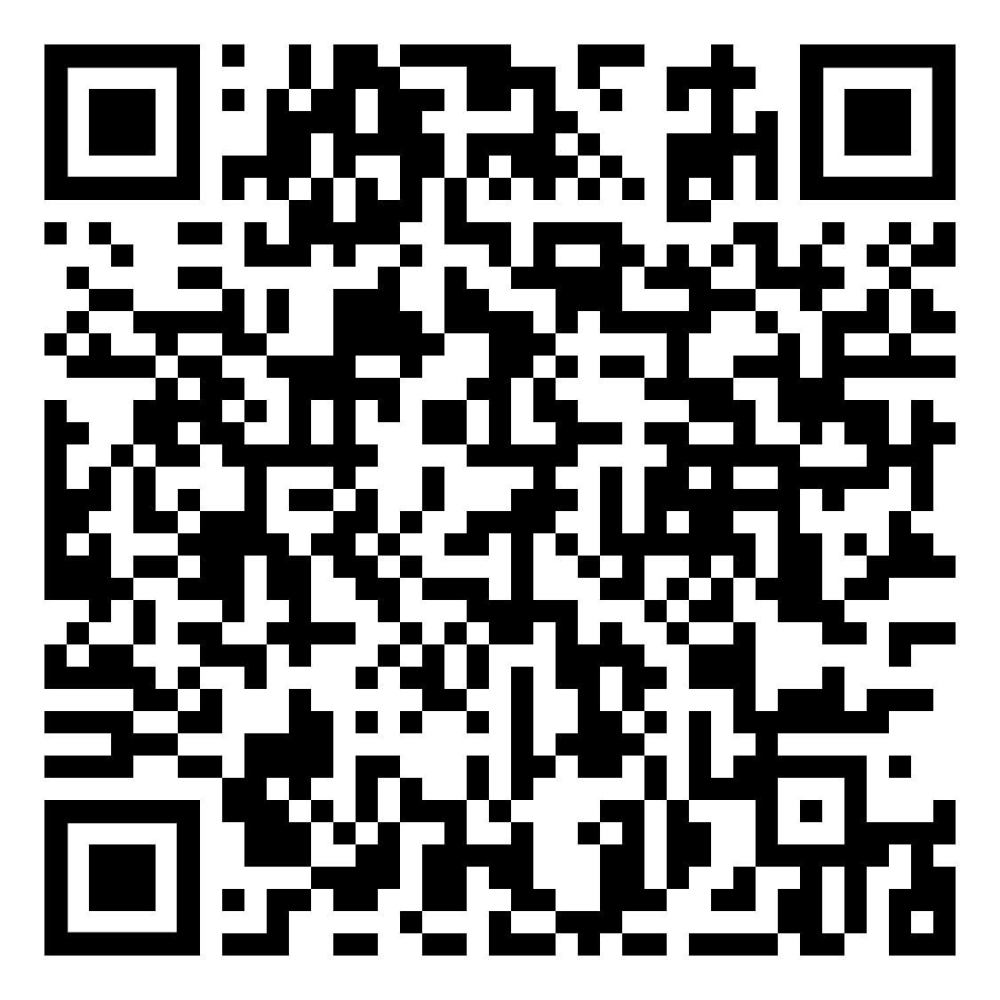

# LabelMaster4Android

Application for verification of genuine of a specially designed label

This software uses machine learning to verify if data in QR code i correct. Such method is not 100% always true, there will be false positive and negative. 
Note that data printed in QR code have to be prepared with use of LabelMaster4.0 software. No other will work.

UI

Sample correct code:

  
Sample false code:

 
Rest of the package:
https://github.com/PDymala/LabelMaster4Crypto
https://github.com/PDymala/LabelMaster4MLTraining

 
2D scaning: modification of https://github.com/yuriy-budiyev/code-scanner
WEKA for Android: https://github.com/andrecamara/weka-android
 WEKA in general: https://www.cs.waikato.ac.nz/ml/weka/
